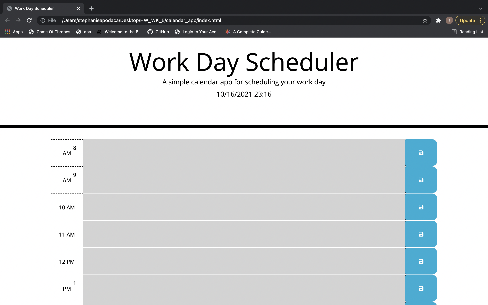

# Calendar App
## Description
This calendar app was designed to help you keep track of your work day activities.  The calendar is broken up into one hour sections from 8am-5pm.  The task/notes are saved in local storage on your browser.


## Usage

Simply add your task next to the hour you choose and then click the blue save button, your task will then save to local storage.

Screen Shot:
    ```md
    
    ```
